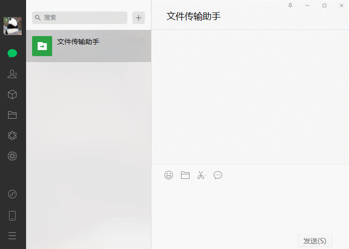
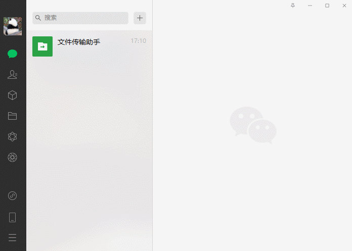
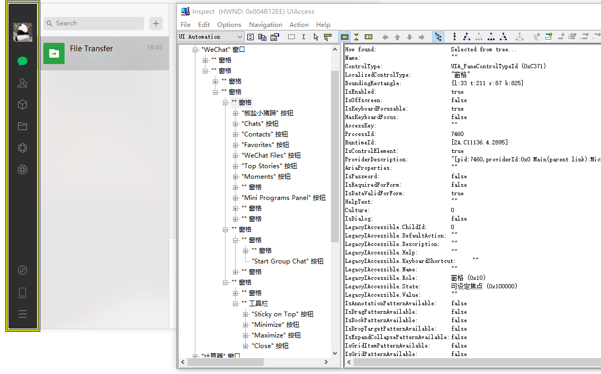

# WeChat Automation

## What Is Robotic Process Automation (RPA)

Robotic process automation (RPA) occurs when basic tasks are automated through software or hardware systems that
function across a variety of applications, just as human workers do. The software or robot can be taught a workflow with
multiple steps and applications, such as taking received forms, sending a receipt message, checking the form for
completeness, filing the form in a folder, and updating a spreadsheet with the name of the form, the date filed, and so
on. RPA software is designed to reduce the burden for employees of completing repetitive, simple tasks.

## Preview

### Send messages to friends

### Send messages to myself

### UIA

[Download Windows Kits Inspect](https://github.com/yihleego/Windows-Kits)

